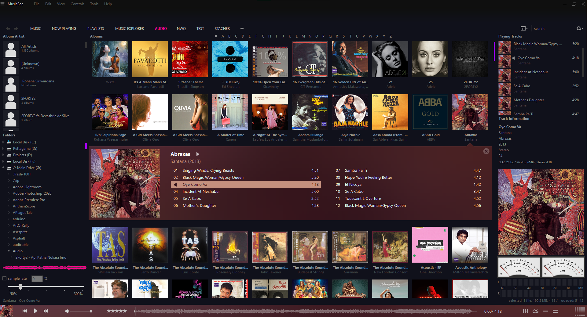

# Blossom Theme for Gnome-Terminal

## Preview

## Installation

download the file
    - [XML File](./Blossom.xml)

extract the file
    Most files will be in .zip or .rar format.  You need the .xml or .xmlc contained inside.*  You can extract directly to your skins folder (see next step) or to your default download location.
move .xml or .xmlc file to the 'Skins' folder
    The default installation folder for this is: C:\Program Files\MusicBee\Skins but you may have to adjust this for your set-up.  You can copy-and-paste, drag-and-drop, or extract directly from the compressed file.  Whatever you are most comfortable and proficient at.
start MusicBee
    Or, if you had it running while doing this, restart.
select the new skin
    Select the skin from either the Bee or drop-down menus, MusicBee will automatically restart to change to the new look.
use the new skin

That's It...
Enjoy!